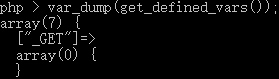

# 利用_GET绕过过滤

### 一.	CTF题目

```php
<?php
if(';' === preg_replace('/[^\W]+\((?R)?\)/', '', $_GET['code'])) {    
    eval($_GET['code']);
} else {
    show_source(__FILE__);
}
```

首先看一下正则，"\[^\w]+" —— 匹配以数字/字母/下划线为开头的字符串，"\\(" —— 匹配左括号，"(?R)?" —— "(?R)"表示对整个表达式的递归引用，因为递归出的正则同样包含"(?R)"会再次递归，而后面的"?"则相当于给递归设置了一个终止条件(匹配0次)。所以正则匹配的是嵌套的无参函数 —— "foo(foo(foo()));"

### 二.	解题思路

  由于"\$\_GET['code']"只能是嵌套的无参函数所以很难直接通过执行"\$\_GET['code']"来获取flag，能读取文件或写入文件的代码都需要包含文件路径。题目中"eval(\$\_GET['code']);"是执行了GET方式传递的参数"code"，而正则只检查了参数"code"的值，如果我们使得参数"code"的值等于另外一个GET参数的值，而正则并未检查另外一个参数，这样就绕过了过滤。只要让"$\_GET['code'] = \$\_GET['x']"，然后将要执行的代码作为参数"x"就解决了问题。

  现在的问题就是怎么通过无参函数获取到另外一个GET参数的值。我们都知道"_GET"其实是PHP的全局变量，通过查找PHP文档可以找到一个获取全局变量的函数：

```php
array get_defined_vars ( void )
```

我们运行一下这个函数，看看结果



可以看到返回的多元数组的第一个元素就是"_GET"数组；因为本地没有接收到GET参数所以数组为空，若接收到参数则值为GET参数的数组。但是此时取出来的是一个数组而我们需要它的值但又不能通过"array['x']"的形式取值，所以我们需要用到数组操作函数：

```php
array array_values ( array $array )
```

此时返回的是"\_GET"数组所有的值，但返回值仍然是多元数组 —— ' array(4) { array(2) { ["x"] => string(1) "x", ["arg\_2"] => string(5) "arg\_2" } } [1]=> array(0) { } [2]=> array(0) { } [3]=> array(0) { } } '，所以还需要使用另外一个数组操作函数：

```php
mixed current ( array &$array )
```

返回数组中的当前单元，也就变成了'array(2) {["x"] => string(1) "x", '["arg\_2"] => string(5) "arg\_2}'。然后再使用**current()**，取出我们想得到的值"x"。注意因为"current"是取当前单元，在初始条件下当前单元就是数组的第一个元素，所以构造payload时参数"x"要放在参数"code"的前面

最终的payload如下：

```php
http://51.158.75.42:8084/?x=var_dump(readfile(%22./../flag_phpbyp4ss%22));&code=eval(current(current(array_values(get_defined_vars()))));
```


